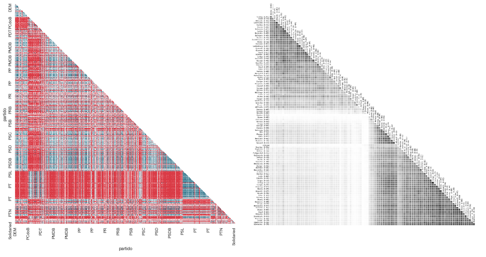

# Análise do jogo político na Câmara dos Deputados


_Figura: Comparação de posicionamento político. Esquerda: Brasil. Direita: EUA._


Este repositório contém um exemplo prático de como extrair e analisar dados de votações utilizando a [API de Dados Abertos da Câmara dos Deputados](https://dadosabertos.camara.leg.br).

Veja os detalhes da análise no [notebook](./jogo-politico.ipynb).

# Dependências

Você precisa instalar os seguintes softwares:
* [Anaconda (Python 3.x)](https://www.continuum.io/downloads)
* [Git](https://www.atlassian.com/git/tutorials/install-git)

# Como executar o código

1. Abra o **terminal** (no Windows, utilize o "Anaconda Prompt") e clone este repositório no diretório desejado:
```
git clone https://github.com/thefonseca/jogo-politico.git
```

2. Navegue para o diretório do repositório clonado:
```
cd jogo-politico
```

3. Execute o seguinte comando para criar um ambiente com todas as dependências (se esse comando não funcionar, talvez você precise [configurar o proxy no Anaconda](https://conda.io/docs/config.html#configure-conda-for-use-behind-a-proxy-server-proxy-servers)): 
```
conda env create -f environment.yml
```

4. Ative o ambiente "dadosabertos":
* Windows
```
activate dadosabertos
```

* OSX e Linux
```
source activate dadosabertos
```

5. Inicie o [Jupyter Notebook](http://jupyter.org):
```
jupyter notebook jogo-politico.ipynb
```

# Referências

* [Dados Abertos da Câmara dos Deputados](https://dadosabertos.camara.leg.br)
* [Analyzing the U.S. Senate in 2003: Similarities, Clusters, and Blocs](http://www.stat.columbia.edu/~jakulin/Politics/)
* [k-means clustering US Senators](https://www.dataquest.io/blog/k-means-clustering-us-senators)
* [t-Distributed Stochastic Neighbor Embedding (t-SNE)](https://lvdmaaten.github.io/tsne/)
* [Principal Component Analysis](https://en.wikipedia.org/wiki/Principal_component_analysis)
* [Distance computations (scipy.spatial.distance)](https://docs.scipy.org/doc/scipy/reference/spatial.distance.html)
* [Estadão Dados: Basômetro](http://estadaodados.com/basometro)
* [Radar Parlamentar](http://radarparlamentar.polignu.org/)
* [Atlas Político](http://www.atlaspolitico.com.br)
* [GovTrack (EUA)](https://www.govtrack.us)
